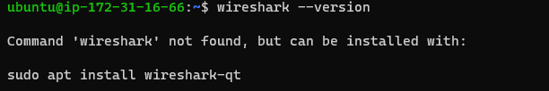

# DOCUMENTATION OF PROJECT 12

In this project we are going to make improvement onnour codes from project-11

Refactor your Ansible code, create assignments, and learn how to use the imports functionality

Firstly let's make changes to our jenkins job, in Jenkins-Ansible server create a new directory called ansible-config-artifact, we will store all artifacts after each build there.

Now in our jenkins console we install the copy artifact plugin. Now we create a freestyle project and name it savee artifacts.

This project will be triggered by completion of the existing ansible project.

The main idea of save_artifacts project is to save artifacts into `/home/ubuntu/ansible-config-artifact` directory. To achieve this, create a Build step and choose Copy artifacts from other project, specify ansible as the source project and `/home/ubuntu/ansible-config-artifact` as a target directory.


Now the jenkins pipeline is more clean and neat.

Now we are going to refactor Ansible code by importing other playbooks.

Within playbooks folder, create a new file and name it `site.yml` , This file will now be considered as an entry point into the entire configuration.

Now create a new folder in root of the repository and name it `static-assignments`. The static-assignments folder is where all other children playbooks will be stored. This is merely for easy organization of your work and not a mandatory practice.

Now move common.yml file into the newly created static-assignments folder.

Now Since we need to apply some tasks to our dev servers and wireshark is already installed – we go ahead and create another playbook under static-assignments and name it `common-del.yml`. 

 We configure deletion of wireshark utility in this playbook
 ```
---
- name: update web, nfs and db servers
  hosts: webservers, nfs, db
  remote_user: ec2-user
  become: yes
  become_user: root
  tasks:
  - name: delete wireshark
    yum:
      name: wireshark
      state: removed

- name: update LB server
  hosts: lb
  remote_user: ubuntu
  become: yes
  become_user: root
  tasks:
  - name: delete wireshark
    apt:
      name: wireshark-qt
      state: absent
      autoremove: yes
      purge: yes
      autoclean: yes
```

paste the above command in your playbook.

Now we push the chnages to our ansible-jenkins server.

then run the command `ansible-playbook -i inventory/dev.yml playbooks/site.yaml`




### THE ABOVE IMAGES SHOW THAT OUR COMMAND WAS SUCCESFUL.

We have our clean dev environment, so let us put it aside and configure 2 new Web Servers as UAT

launch 2 instances usng RHEL 8 image 

Now we use a dedicated role directory to configure the new servers

Now we create a directory called roles relative to the playbook file.

Now we create this files/directory structure manually.


 
 Above image shows our file structure.Now we start the configuration for our files.

 Now we update the inventory ansible-config-mgt/inventory/uat.yml file with IP addresses of the 2 UAT Web servers.

 Now in /etc/ansible/ansible.cfg file uncomment roles_path string and provide a full path to your roles directory so ansible can know where to find configured roles.


Now we goto tasks directory, and within the main.yml file, start writing configuration tasks to do the following:

1. Install and configure Apache (httpd service)
2. Clone Tooling website from GitHub https:// github.com/<your-name>/tooling.git.
3. Ensure the tooling website code is deployed to /var/www/html on each of 2 UAT Web servers.
4. Make sure httpd service is started.

```
---
- name: install apache
  become: true
  ansible.builtin.yum:
    name: "httpd"
    state: present

- name: install git
  become: true
  ansible.builtin.yum:
    name: "git"
    state: present

- name: clone a repo
  become: true
  ansible.builtin.git:
    repo: https://github.com/<your-name>/tooling.git
    dest: /var/www/html
    force: yes

- name: copy html content to one level up
  become: true
  command: cp -r /var/www/html/html/ /var/www/

- name: Start service httpd, if not started
  become: true
  ansible.builtin.service:
    name: httpd
    state: started

- name: recursively remove /var/www/html/html/ directory
  become: true
  ansible.builtin.file:
    path: /var/www/html/html
    state: absent
```

the above command should be inputed into the Task playbook

Now within the static-assignments folder, create a new assignment for uat-webservers uat-webservers.yml. This where we reference the role.

```
---
- hosts: uat-webservers
  roles:
     - webserver
```
Input the above code in the file so it can reference the file uat-webservers.

Now we have to refer our uat-webserver role inside the site.yml file as this is our entry point.

```
---
- hosts: all
- import_playbook: ../static-assignments/common.yml

- hosts: uat-webservers
- import_playbook: ../static-assignments/uat-webservers.yml
```

we input the above code into our site.yml file.

Now we commit and push our changes so we can test. 

Now we run the command below and see if our configurations works 
```
sudo ansible-playbook -i /home/ubuntu/ansible-config-mgt/inventory/uat.yml /home/ubuntu/ansible-config-mgt/playbooks/site.yaml
```


the above image shows that our configuration works as expected.

Now lets our configuration on the webbrowser.


THE ABOVE IMAGE SHOWS THAT OUR CONFIGURATION WAS SUCCESFUL.

### We have been able to deploy and configure UAT Web Servers using Ansible imports and roles.


